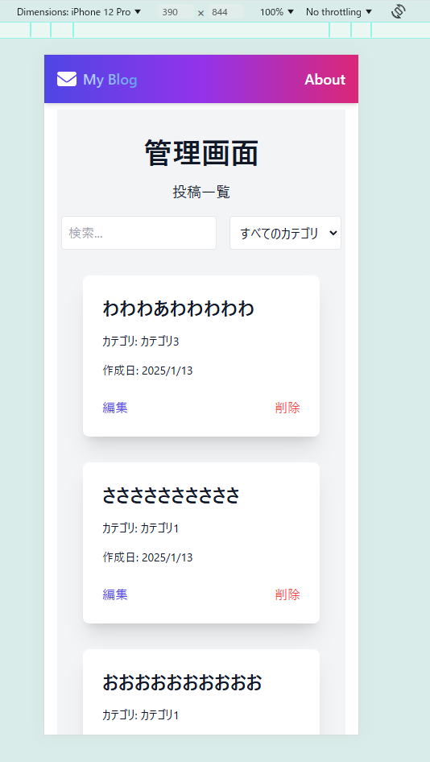

# next-blog-app
Next.jsで作成したブログアプリケーションです。

## 背景情報
- 2024年12月~2025年2月

## 技術スタック
- Next.js
- TypeScript
- Prisma
- Supabase

## 機能
### **記事一覧ページ**
記事の一覧をカード形式で表示します。本文一部と、投稿日時、タグが表示されます。

### **記事詳細ページ**
記事の詳細を表示します。記事には必ず一つの写真が紐づけされており、その写真はSupabaseのStorageに保存されています。

### **管理画面**
記事の追加、更新、削除ができます。また、カテゴリの追加、更新、削除もできます。管理画面ルートは`/admin`で、Supabaseの認証を通じてログインします。ログインページは`/login`です。

### APIについて
以下のエンドポイントを実装しています：

| メソッド | エンドポイント | 説明 |
|---------|--------------|------|
| GET | /api/posts | 全記事の取得 |
| GET | /api/posts/:id | 特定の記事の取得 |
| GET | /api/categories | 全タグの取得 |
| POST | /api/admin/posts | 記事の追加 |
| PUT | /api/admin/posts/:id | 記事の更新 |
| DELETE | /api/admin/posts/:id | 記事の削除 |
| POST | /api/admin/categories | カテゴリの追加 |
| PUT | /api/admin/categories/:id | カテゴリの更新 |
| DELETE | /api/admin/categories/:id | カテゴリの削除 |

